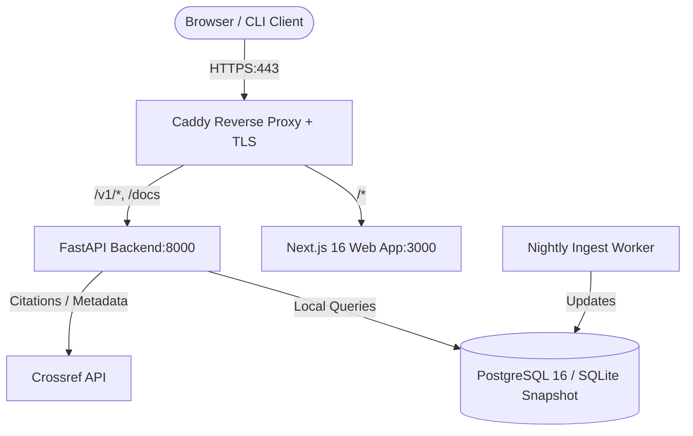

# OpenPaperCheck Infrastructure & Deployment Runbook

This directory contains the production infrastructure, Docker orchestration, automated monitoring, and disaster recovery tooling for **OpenPaperCheck**.

---

## 1. Architecture Overview



---

## 2. Docker Environments

### Local Full-Stack Development
```bash
# Start all local containers (API on :8000, Web on :3000, DB on :5432)
docker compose up --build

# Stop all local containers
docker compose down
```

### Production Deployment
```bash
# Configure production secrets in .env
cp .env.example .env

# Start production stack with Caddy reverse proxy and auto-HTTPS
docker compose -f docker-compose.prod.yml up -d --build
```

---

## 3. Automation Scripts (`infra/scripts/`)

| Script | Purpose | How to Run |
|---|---|---|
| `healthcheck.sh` | Verifies API health, DB status, and snapshot age (<30 days) | `./infra/scripts/healthcheck.sh` |
| `backup.sh` | Dumps DB, gzips, encrypts with AES-256-CBC, computes SHA256 | `./infra/scripts/backup.sh` |
| `restore.sh` | Verifies SHA256 checksum, decrypts with OpenSSL, restores DB | `./infra/scripts/restore.sh` |
| `nightly_ingest.sh` | Runs nightly sync to update Retraction Watch database | `./infra/scripts/nightly_ingest.sh` |
| `pre_deploy_backup.sh`| Automatically runs before migrations during deploy | `./infra/scripts/pre_deploy_backup.sh` |

---

## 4. Disaster Recovery & Restore Drill

A restore drill should be executed at least once per release milestone to guarantee zero data loss.

### Executing a Drill:
```bash
# 1. Create an encrypted backup
./infra/scripts/backup.sh

# 2. Run the restore drill
./infra/scripts/restore.sh
```

### Verifying Restore Output:
```text
==> [Restore Drill] Target archive: ./infra/backups/opc_backup_*.enc
==> Verifying SHA256 checksum...
==> Checksum verified.
==> Decrypting archive with OpenSSL...
==> Gzip test passed. Archive is fully recoverable.
==> [Restore Drill] SUCCESS: Database recovery drill completed without errors.
```

---

## 5. Security & Moderation

### Hiding / Unhiding a Page (Moderation Stub):
If a paper report must be hidden from public view (e.g. active legal dispute or GDPR request):
```bash
# Hide page from public web interface and API
opc hide 10.1016/s0140-6736(97)11096-0 --reason "Administrative review pending"

# Check all currently hidden DOIs
opc hidden

# Unhide page and restore public access
opc unhide 10.1016/s0140-6736(97)11096-0
```
When a paper is hidden, the API returns **RFC 9457 HTTP 451 (Unavailable For Legal Reasons)**.
